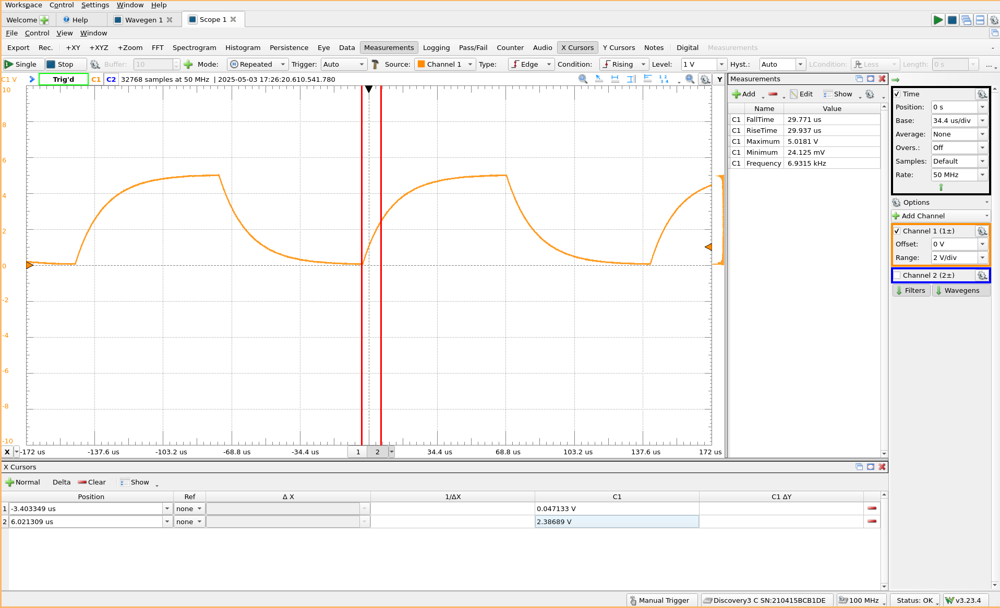

# Introduction

Understanding the step response of R-C circuits is crucial to understanding more
complex circuits and gives insight into the physical properties of capacitors
(i.e. what they actually *do* over time, and not just how they settle into
steady-state configurations).

# Capacitor and Resistor Calculations

To find a capacitor and resistor value, we start with the step response
equation:

$$ V(t) = V_{\inf} + [V_0 - V_{\inf}]e^{-\frac{t}{\tau}} \qquad \tau=RC $$

Assuming we start at 0 V and that the maximum voltage is 5 V:

$$ V(t) = 5 + [0 - 5]e^{-\frac{t}{RC}} $$

Given the time to reach 50% of 5 V (2.5 V):

$$ 2.5 = 5 + -5e^{-\frac{10\times 10^{-6}}{RC}} \implies 1 = 2e^{-\frac{10\times
10^{-6}}{RC}} $$

$$ \ln 1 = \ln \left( 2e^{-\frac{10\times 10^{-6}}{RC}} \right) \implies 0 = \ln
2 -\frac{10\times 10^{-6}}{RC} $$

$$ RC \ln 2 = 10\times 10^{-6} \implies \boxed{RC = 14.427 \, \mathrm{\mu s}} $$

If the capacitor is set at **0.01 micro-Farads**, then it follows that the resistor
must be **1442.7 ohms**.

# Square Wave Calculations

Assuming a capacitor is "fully charged" at $t=5\tau$ and that the square wave's
period includes both a positive and negative section:

$$ t = 5 \times 14.427 \, \mathrm{\mu s} = 72.135 \, \mathrm{\mu s} $$

$$ T = 2 \times 72.135 \, \mathrm{\mu s} = 144.27 \, \mathrm{\mu s} $$

$$ f = \frac{1}{T} \implies \boxed{f = 6.931 \, \mathrm{kHz}} $$

# Results

# Conclusion (Ceramic vs Electrolytic Capacitors)

Ceramic capacitors use ceramic as the dielectric between the conducting plates
whereas electrolytic capacitors use a thin oxide layer on metal as the
dielectric. The polarity determines which way the voltage drop/gain across a
capacitor must face. For ceramic capacitors, this direction doesn't matter, and
so they are said to be non-polarized. Electrolytic capacitors, on the other
hand, do have a polarity, and need to be placed in a circuit where the positive
and negative (or smaller voltage) nodes match the capacitor.

