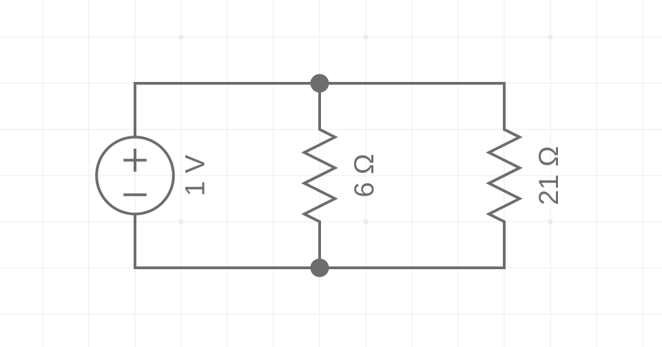
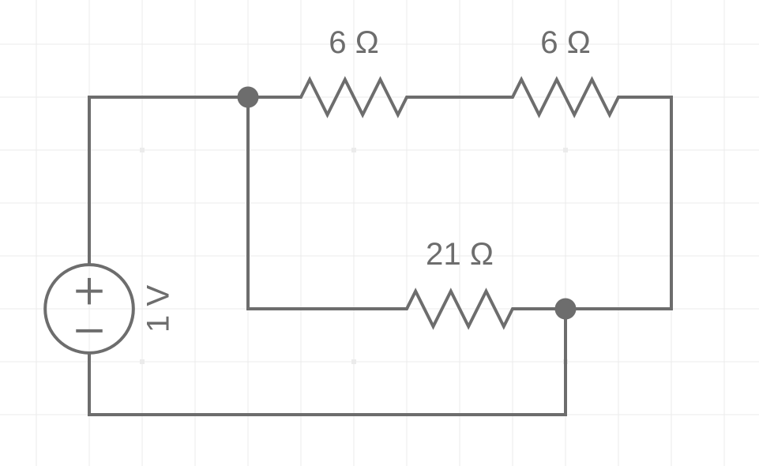
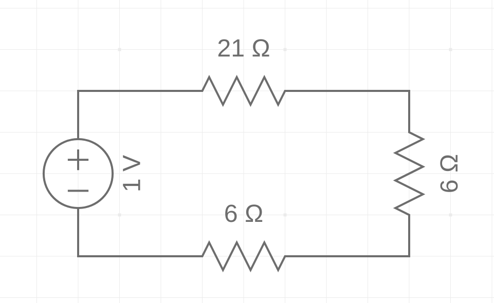
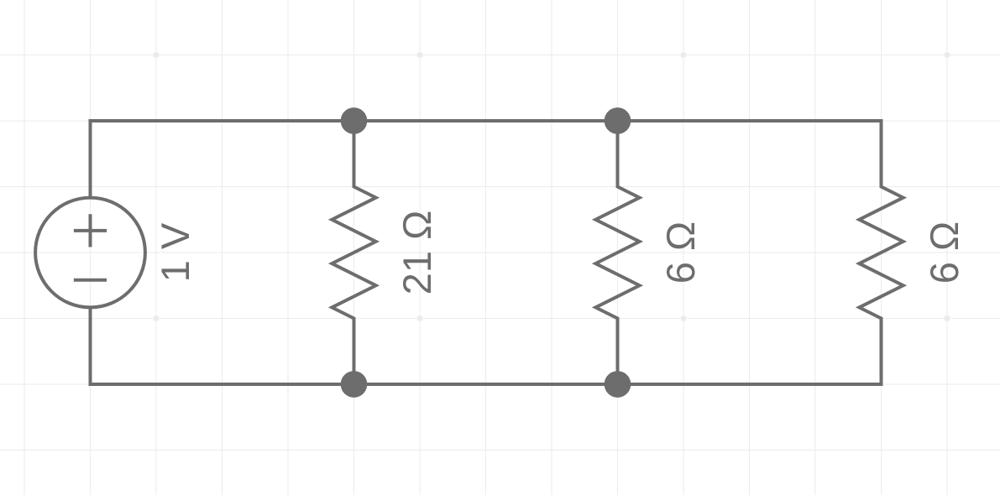
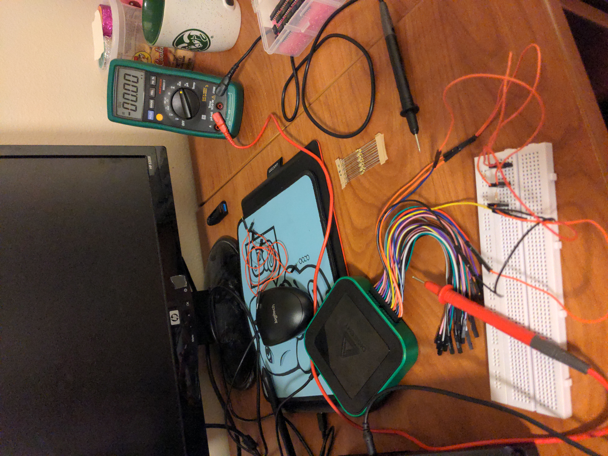
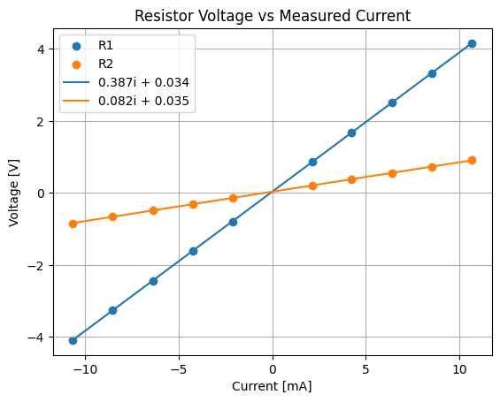

# Introduction

Now we are on to physical electronics. With a multi-meter, resistors,
capacitors, inductors, transistors, and all other sorts of electronic
components, many circuits can be experimented with like some are here. The
resistor band patterns are incredibly important for differentiating resistors.
Waveforms is likewise a very important piece of software for testing circuits.
Working with these tools and components will increase theoretical and practical
understanding.

# Exercise 1

The circuit schematics are in the order they appear in the instructions. The 1 V
power supply is arbitrary.









# Exercise 2

## Part 1

| 1st band | 2nd band | 3rd band | 4th band | Resistance ± Tolerance |
|----------|----------|----------|----------|------------------------|
| Orange   | Orange   | Red      | Silver   | 3300 ohm ± 10%         |
| Green    | Blue     | Red      | No band  | 5600 ohm               |
| Brown    | Black    | Orange   | Gold     | 10000 ohm ± 5%         |
| Black    | Brown    | Brown    | No band  | 10 ohm                 |

## Part 2

| Resistor | 1    | 2    | 3   |
|----------|------|------|-----|
| Nominal  | 100  | 100  | 470 |
| Measured | 98.1 | 99.7 | 465 |

How much of a difference is there between the ideal and true resistance values?
Not much.

Does this fit in the acceptable tolerance limits? Yes.

## Part 3

|    | Resistance (Ohm) | Case (Imperial) | Tolerance (%) | Price (USD) for 10 pcs |
|----|------------------|-----------------|---------------|------------------------|
| #1 | 12M              | 0201            | 1%            | $2.67 \times 10^{-6}$  |
| #2 | 0                | 0201            | 1%            | 0.021                  |
| #3 | 10k              | 0603            | 0.01%         | 14.1                   |
| #4 | 500G             | 2512            | 20%           | 97.9                   |
| #5 | 50               | 0603            | 1%            | 0.001                  |

# Exercise 3

The experimental setup:



The resistors values chosen are:

$$ R_1 = 470 \Omega $$

$$ R_2 = 100 \Omega $$

| $V_S$ (V) | $V_1$ (V) | $V_2$ (V) | I (mA) | $V_1+V_2$ (V) | $V_1/R_1$ (mA) | $V_2/R_2$ (mA) |
|-----------|-----------|-----------|--------|---------------|----------------|----------------|
| -5        | -4.08     | -0.84     | -10.65 | -4.92         | -8.6           | -8.4           |
| -4        | -3.25     | -0.66     | -8.51  | -3.91         | -6.9           | -6.6           |
| -3        | -2.44     | -0.48     | -6.38  | -2.92         | -5.1           | -4.8           |
| -2        | -1.61     | -0.31     | -4.24  | -1.92         | -3.4           | -3.1           |
| -1        | -0.79     | -0.14     | -2.11  | -0.93         | -1.6           | -1.4           |
| 1         | 0.86      | 0.21      | 2.13   | 1.07          | 1.8            | 2.1            |
| 2         | 1.68      | 0.38      | 4.25   | 2.06          | 3.5            | 3.8            |
| 3         | 2.51      | 0.55      | 6.38   | 3.06          | 5.3            | 5.5            |
| 4         | 3.33      | 0.73      | 8.52   | 4.06          | 7.0            | 7.3            |
| 5         | 4.15      | 0.91      | 10.66  | 5.06          | 8.8            | 9.1            |

# Exercise 4

a) Since the resistors are in series, they all have the same current, which is
the voltage drop across the resistor divided by the resistance, Ohms' Law:

$$ I = \frac{V}{R} $$

b) Yes. The loop which goes from the positive terminal and ends at the negative
terminal of the voltage source (ground) has a voltage sum equal to zero.

c) The sign of the voltage would swap, since the voltage across the two wires
would be swapped.

d) The sign switched for the *calculated* current, but, physically, no.

d) The absolute value of the measured voltages still fufill KVL, although the
measured voltages are contray to the sign convention.

# Exercise 5

Code in Python; I can easily do MATLAB (I took CBE 160), but Python is
significantly more readable, which works better for a lab report:

```py
import numpy as np
import matplotlib.pyplot as plt

v1 = np.array([-4.08, -3.25, -2.44, -1.61, -0.79, 0.86, 1.68, 2.51, 3.33, 4.15])
v2 = np.array([-0.84, -0.66, -0.48, -0.31, -0.14, 0.21, 0.38, 0.55, 0.73, 0.91])

i = np.array([-10.65, -8.51, -6.38, -4.24, -2.11, 2.13, 4.25, 6.38, 8.52, 10.66])

m1, b1 = np.polyfit(i, v1, 1)
m2, b2 = np.polyfit(i, v2, 1)

plt.title("Resistor Voltage vs Measured Current")
plt.xlabel("Current [mA]")
plt.ylabel("Voltage [V]")
plt.grid()
plt.scatter(i, v1)
plt.scatter(i, v2)
plt.plot(i, m1 * i + b1)
plt.plot(i, m2 * i + b2)
plt.legend(
    [
        "R1",
        "R2",
        f"{round(m1, 3)}i + {round(b1, 3)}",
        f"{round(m2, 3)}i + {round(b2, 3)}",
    ]
)
```



Converting the slope valuse (resistance) from milli-ohms to ohms yields:

|          | R1  | R2  |
|----------|-----|-----|
| Measured | 387 | 82  |
| Nominal  | 470 | 100 |

The values from the lines of best fit are similar to the real values, but are
still off by 83 for R1 and 18 for R2. This error is within reason for the
magnitudes of the resistors.

# Exercise 6

Another 100 ohm resistor (R3) was added in parrellel with the other 100 ohm resistor (R2).

| $V_S$ (V) | $V_1$ (V) | $V_2$ (V) | I (mA) | $V_1+V_2$ (V) | $V_1/R_1$ (mA) | $V_2/R_2$ (mA) | $V_3/R_3$ (mA) |
|-----------|-----------|-----------|--------|---------------|----------------|----------------|----------------|
| -5        | -4.48     | -0.44     | -10.57 | -4.92         | -9.5           | -4.4           | -4.4           |
| -3        | -2.95     | 0.02      | -6.3   | -2.93         | -6.2           | 0.2            | 0.2            |
| -1        | -0.94     | 0.2       | -2.09  | -0.74         | -2.0           | 2.0            | 2.0            |
| 1         | 1.03      | 0.04      | 2.09   | 1.07          | 2.0            | 0.4            | 0.4            |
| 3         | 3.03      | 0.04      | 6.31   | 3.07          | 6.4            | 0.4            | 0.4            |
| 5         | 5.01      | 0.05      | 10.54  | 5.06          | 10.0           | 0.5            | 0.5            |

a) Unlike the first circuit, there is a current divider across the two resistors
(R2, R3) which are in parrelel. The current across each is given by:

$$ I_x = \frac{R_T}{R_x+R_T} I_T $$

where $I_x$ is the current across the desired resistor, $I_T$ is the total
current entering all the resistors in parallel, $R_x$ is the resistor in
question, and $R_T$ is the equivalent resistance of all the other resistors.

Or, if the voltage between the nodes is known, Ohms' Law can be used for each
resistor separately.

b) Yes. Same explanation as exercise 4.

c) Yes. The current across R1 is equal to the sum of the currents across R2 and
R2, for the most part (some issue arose when measuring the voltage drops for a
positive source).

d) Explained in exercise 4, (c).

e) No, but current follows the passive sign convention, so there is a change in
the current's sign, assuming the direction of current is set by convention.

# Conclusion

After finishing all the exercises, I realized how finicky some of the
electronics were. Regardless, I learned how to identify resistors and use a
breadboard. Using the Waveforms software also helped me understand how to
interact with electronics through a computer interface, which allows for more
complex circuits. These skills will be essential for future labs and other
practical applications.


