# Introduction

Diodes are another fundamental electronic element. Alternative currents (voltage
waveforms) are also incredibly important. Here we learn about resistance
characteristic curves and the resistivity of diodes.

# Exercise I

The randomly chosen resistor values are:

$$R_1 = 100\Omega, \;R_2 = 1000\Omega$$

## Part 1

a) Both channels have the same range for voltage and time.

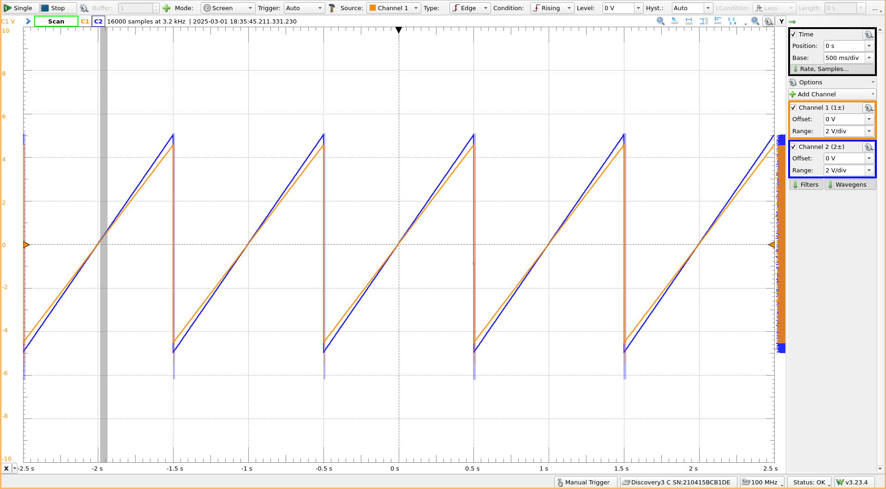

b) Channel 1 (the voltage across R2) is very close to channel 2 (the voltage
across the source). It is almost the same voltage as channel 2, but it is off
since it doesn't include R1 (which has much less resistance than R2 at 100 ohms
vs 1000 ohms).

c) The current can be calculated using $I = \frac{V}{R}$ for the entire circuit
(where $R=R_{eq}$ and $V=V_{SG}$) or one resistor ($R=R_2$, $V=V_R$). Both
currents should be the same, since the circuit has no current dividers.

## Part 2

d-e) 

f) 

g) Both M1 plots show the same current, which makes sense. The C1 curve when
measured across R1 is much less than when measured across R2, which makes since
since the voltage drop across R2 (1000 ohms) is greater than across R1 (100
ohms). Both characteristic curves are unique, since they have different slopes
(resistance).

h) All four graphs, made using Python:

```python
import matplotlib.pyplot as plt
import numpy as np
from numpy import genfromtxt

r1_data = genfromtxt("resistor_1.csv", delimiter=",", names=True)
r2_data = genfromtxt("resistor_2.csv", delimiter=",", names=True)

r1_voltage = r1_data["Channel_1_V"]
r2_voltage = r2_data["Channel_1_V"]

r1_current = r1_data["Math_1_A"]
r2_current = r2_data["Math_1_A"]

r1_power = r1_voltage * r1_current
r2_power = r2_voltage * r2_current

# Data sliced at certain chunks for plot clarity

plt.title("Resistor 1: Power vs Current")
plt.xlabel("Current [mA]")
plt.ylabel("Power [mW]")
plt.grid()
plt.plot(r1_current[0:2100] * 1000, r1_power[0:2100] * 1000)

plt.title("Resistor 1: Power vs Voltage")
plt.xlabel("Voltage [V]")
plt.ylabel("Power [mW]")
plt.grid()
plt.plot(r1_voltage[0:2100], r1_power[0:2100] * 1000)

plt.title("Resistor 2: Power vs Current")
plt.xlabel("Current [mA]")
plt.ylabel("Power [mW]")
plt.grid()
plt.plot(r2_current[1500:2450] * 1000, r2_power[1500:2450] * 1000)

plt.title("Resistor 2: Power vs Voltage")
plt.xlabel("Voltage [V]")
plt.ylabel("Power [mW]")
plt.grid()
plt.plot(r2_voltage[6000:7550], r2_power[6000:7550] * 1000)
```

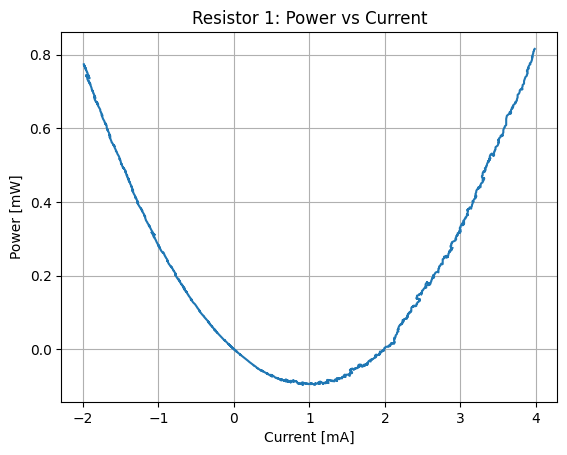

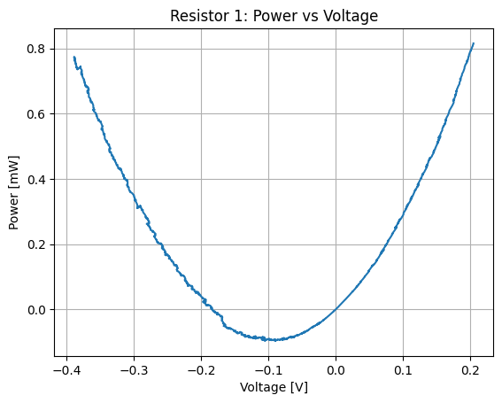

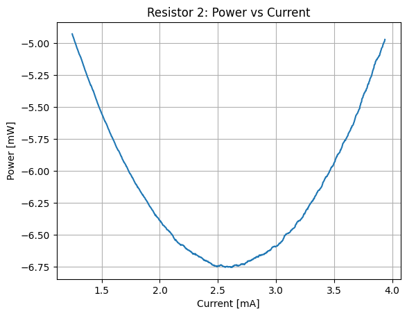

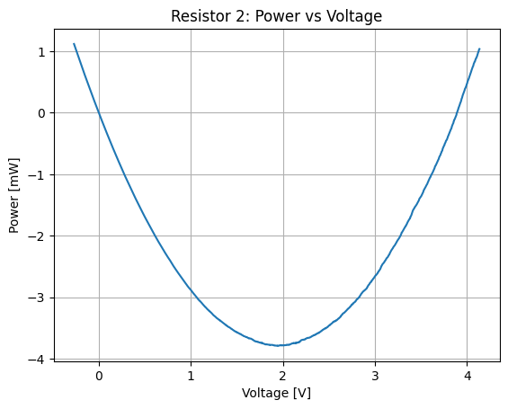

i) It is quadratic since:

$$ P = VI \qquad V = IR $$

$$ \boxed{P = RI^2} $$

j) It is quadratic since:

$$ P = VI \qquad I = \frac{V}{R} $$

$$ \boxed{P = \frac{V^2}{R}} $$

# Exercise II

The 1000 ohm resistor (R2) is replaced with a diode. C1 measures the voltage
across the diode and C2 measures the voltage across the resistor.

a-b) The current through the resistor is the same as the diode in series, so the
calculated current for the resistor applies to the diode too.

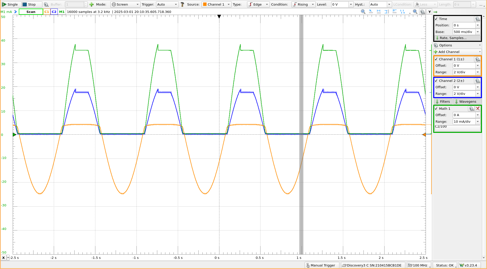

c-d) The curve should look exponential.

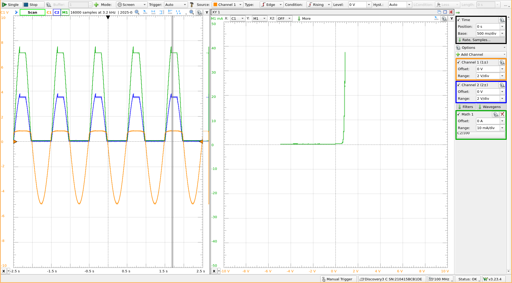

e) See the previous figure for the sinusodial input. Here are three different
waveform inputs (saw-tooth, square, and 50 Hz noise):

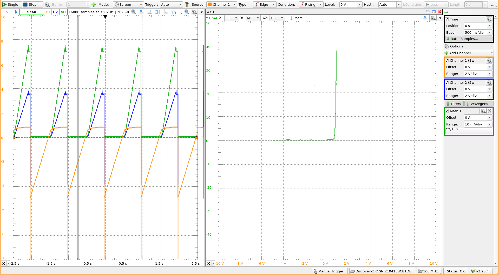

The characteristic looks very similar, which makes sense since it is the most
similar to the sinusodial waveform.

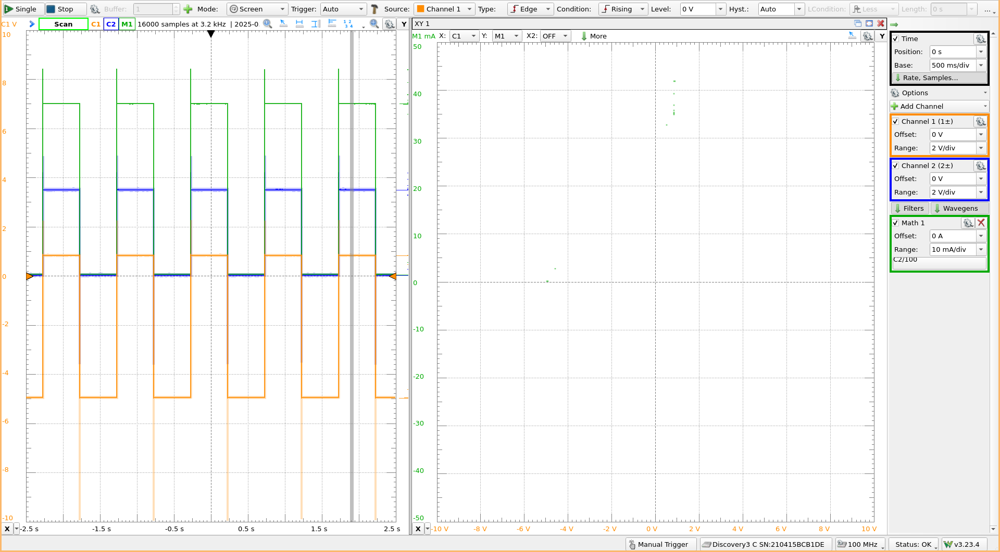

The square wave misses the voltage differences inbetween, so the characteristic
curve is not full.

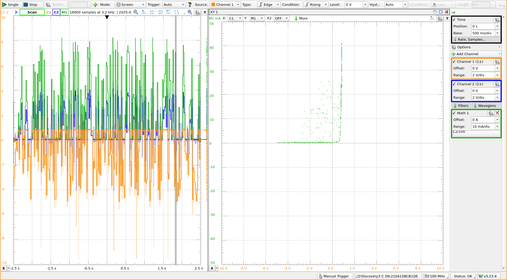

The noise seems to add more random data points on the characteristic curve.

f) The waves I generated (sinusodial, saw-tooth, square, and noise) are
equivelent to the recorded waves. The square wave is unique in that it only has
one voltage difference unlike the other "continous" waves.

g) Yes. The characteristic plots look exponential, so to find the resistance of
the diode would require fitting an exponential curve to the data.

h) Eye-balling the curves on the plot, it seems to conduct at around 800 mV.

i) The maximum current was: 37.41 mA.

j) No. If it were, current would be able to flow in both directions (since a
linear relation isn't piece-wise).

## Question k

(Almost all the plots are the same for the LED.)

c-d) The curve should look exponential.

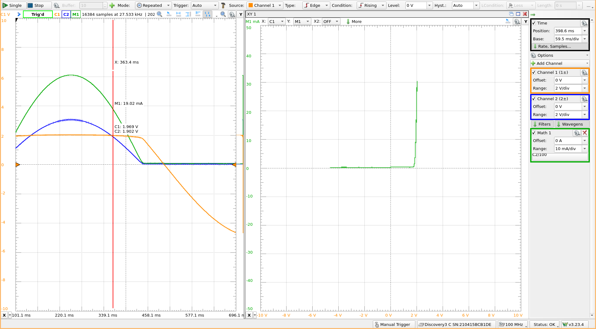


e) See the previous figure for the sinusodial input. Here are three different
waveform inputs (saw-tooth, square, and 50 Hz noise):

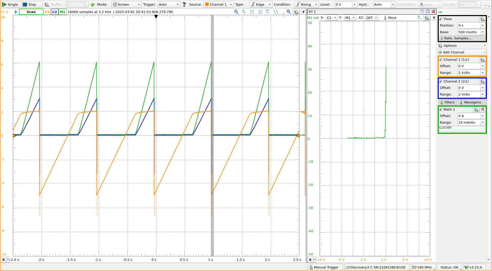

The characteristic looks very similar, which makes sense since it is the most
similar to the sinusodial waveform.

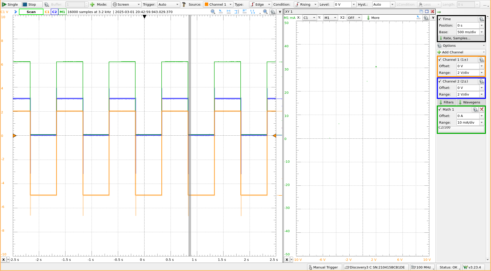

The square wave misses the voltage differences inbetween, so the characteristic
curve is not full.

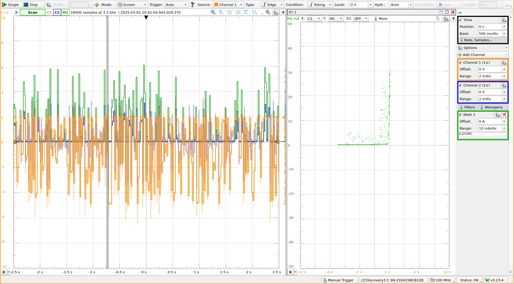

The noise seems to add more random data points on the characteristic curve.

f) The waves I generated (sinusodial, saw-tooth, square, and noise) are
equivelent to the recorded waves. The square wave is unique in that it only has
one voltage difference unlike the other "continous" waves.

g) Yes. The characteristic plots look exponential, so to find the resistance of
the diode would require fitting an exponential curve to the data.

h) Eye-balling the curves on the plot, it seems to conduct at around 2 V.

i) The maximum current was: 30.47 mA.

# Conclusion

The many experiments performed here showcase the uses of alternative currents
in combination with diodes, especially LEDs. This lab also helped me better
understand the use of the Waveforms software.


