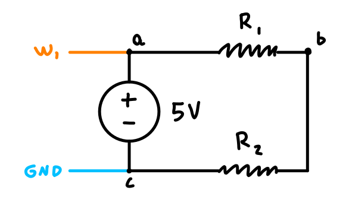
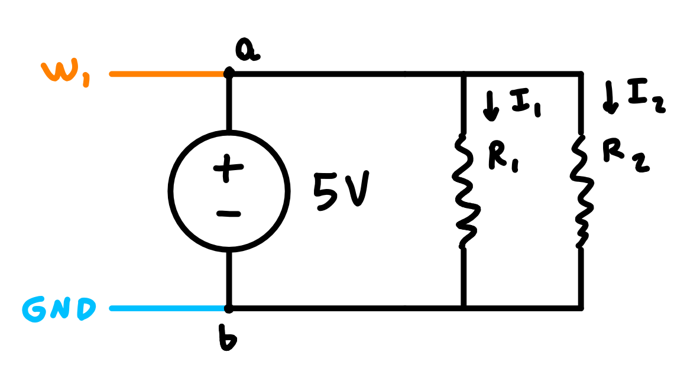

# Introduction

Kirchhoff's Current and Voltage Laws are essential for circuit analysis.
Understanding their applications and method of calculation through real world
circuits helps to ground their concepts in reality.

# Exercise A

1) The multimeter reads the current from (b) to (c') and the voltage between (b)
   and (c'), and (a) and (c').

   

2) Assuming $V_{out}$ is the voltage after R1/across R2, between node (b) and
   (c'), to find the values of R1 and R2 given a required $V_{out}$ and required
   $I$, with arbitrary $V$:

   $$ V_{out} = I R_2 \implies \boxed{R_2 = \frac{V_{out}}{I}} $$

   $$ V = I R_1 + V_{out} \implies \boxed{R_1 = \frac{V-V_{out}}{I}} $$

   With $V = 5 \mathrm{V}$, $V_{out} = 0.05 \mathrm{V}$ and $I = 5 \mathrm{mA}$,
   $\boxed{R_1 = 990 \Omega}$ and $\boxed{R_2 = 10 \Omega}$

3) ${V_{out} = 52.1 \mathrm{mV}}$ and ${I_T = 5.1 \mathrm{mA}}$.

4) The measurements are very close to the predicted values, but any difference
   can be explained by the resistance in the wires or resistor accuracy being
   off.

# Exercise B

1) The multimeter reads the current across R1, R2, and the total current, and
   the voltage between (a) and (b).

   

2) Given the constraints:

   $$ I_1 + I_2 = 3 I_2 + I_2 = 4 I_2 = I_T $$

   $$ V = R_2 I_2 = R_2 \frac{I_T}{4} $$

   $$ \boxed{R_2 = \frac{4V}{I_T}} $$ 

   $$ V = R_1 I_1 = R_1 \frac{3I_T}{4} $$

   $$ \boxed{R_1 = \frac{4V}{3I_T}} $$

   With $I_T = 5 \mathrm{mA}$ and $V=5 \mathrm{V}$:

   $$ \boxed{R_1 = 1333 \Omega} $$

   $$ \boxed{R_2 = 4000 \Omega} $$ 

3) $I_1 = 3.80 \mathrm{mA}$, $I_2 = 1.22 \mathrm{mA}$, and $I_T = 5.1 \mathrm{mA}$.

4) The measurements where significantly closer to the theoretical values than
   exercise A. The discrepancy could again have come from the resistor
   thresholds and multimeter inaccuracy.

# Exercise C

1) | $V_s$ | $I_1$   | $I_2$   | $I_3$   |
   |-------|---------|---------|---------|
   | 5V    | 2.3 mA  | 1.0 mA  | 1.3 mA  |
   | -5V   | -2.3 mA | -1.0 mA | -1.3 mA |

2) Yes. The current into the node equals the current out, and the measured
   values were almost perfectly demonstrative of this.

# Exercise D

1) Assuming the voltages across each branch are for each resistor 1-3, the
   multimeter measured values are:

   $$ V_1 = 4.99 \mathrm{V}, \; V_2 = 7.2 \mathrm{V}, \; V_3 = 2.8 \mathrm{V} $$
   
2) All three resistors have negative polarities for their respective loops
   following the passive sign convention.

3) $$ 0 = 5 - 4.99 $$

4) $$ 0 = -(4.99) + 7.8 -(2.8) $$

5) Yes, with acceptable measurement error.

# Exercise E

1)

|   | 1        | 2        | 3       | 4        |
|---|----------|----------|---------|----------|
| V | -1.760 V | -0.680 V | 0.681 V | -2.607 V |
| I | -2.8 mA  | -2.03 mA | 2.3 mA  | 2.7 mA   |

2) Combining the resistors in parallel, then three in series and using Ohms'
   Law: 2.7 mA.

3)   

|   | 1      | 2      | 3      | 4       |
|---|--------|--------|--------|---------|
| P | 4.7 mW | 1.4 mW | 1.5 mW | -7.0 mW |

4) Sum of powers: 0.6 mW

# Conclusion

Both of Kirchhoff's Laws were proven to work for actual circuits. The values
gathered throughout this lab were in line with both laws for the most part, with
small discrepancies likely coming for resistor thresholds and multimeter error.

