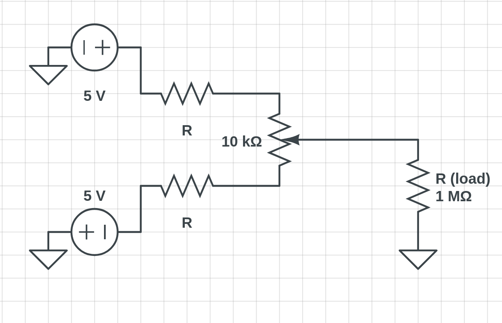
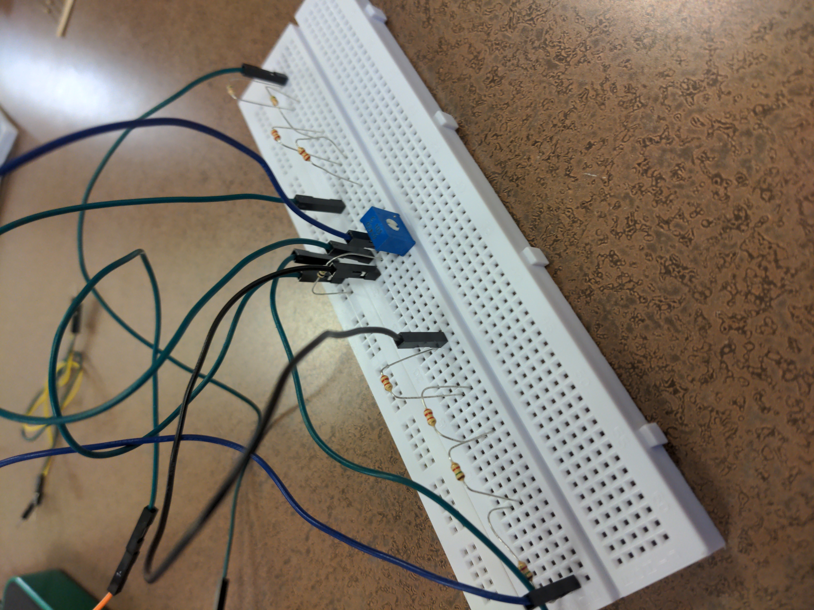
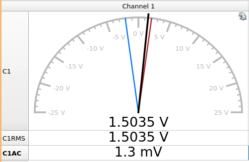
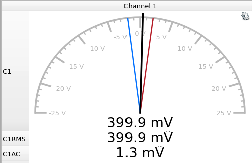

# Introduction

Designing new circuits without full blueprints and testing them to meet
specification is the most fundamental job of electrical engineers. Learning how
to approach open-ended problems and solve them is the core concept that
differentiates engineers from other professions.

# Adjustable Voltage Source Calculations

To get a voltage between -2 V and 2 V from -5 V and 5 V for the 1 MΩ load
resistor, two resistors in series on either side of a potentiometer are used
like so, were the potentiometer is arbitrarily set to one of the three available
values (10 kΩ):

The next set is to calculate the resistance $R$ for which the voltage across the
potentiometer is always 4 V. Since both resisters are $R$, the voltage on one
end of the potentiometer is the negative of the other (-2 V to 2 V).

The potentiometer acts as a voltage divider given by:

$$ V_o = 2V_1 x $$

Where $V_1$ is the voltage at the positive terminal of the potentiometer
(mirrored at the negative terminal, thus times 2) and $x$ is the fractional
resistance set internally, which splits the potentiometer into "two" seperate
resistors who add up to 10 kΩ.

If we assume $x=1$, then $V_1$ must equal 2 V, since the resistance of the "top"
resistor in the potentometer is 0 (short-circuit). otherwise the circuit goes
beyond the allowed voltage range.

Nodal analysis can be used to find the value of $R$:

$$ \frac{5-2}{R} = \frac{2}{1000000} + \frac{2-(-5)}{R+10000} $$

Skipping the algebra done on paper for conciseness, we arrive at a quadratic
equation for $R$, where the *positive* resistance is the one in question:

$$ 0 = (2 \times 10^{-6}) R^2 + 4.02R -30\times10^3 $$

$$ \boxed{R = 7435.183 \, \Omega} $$

The maximum current through any part of the circuit is the current across the
resistor connected to the positive terminal of the potentiometer when it
short-circuits. Using Ohm's law, this is:

$$ I_{\mathrm{max}} = \frac{3}{7435.183} \, \mathrm{A} = \boxed{0.403 \,
\mathrm{mA}} $$

# Results

To make the 7.4 kΩ resistors, I combined two 2.2 kΩ and two 1.5 kΩ resistors for
each. A voltage of ± 5 V is set on each side by the Digilent which also reads
the output voltage and has ground leads.

The voltmeter showed a maximum voltage of around 2 V, as shown in red, and
minimum of 2 V, as shown in blue. The circuit works perfectly. When the 1MΩ
resistor is swapped for a 100 kΩ one, the voltmeter is the same:

# Conclusion

The circuit designed here works for any load resistance, ignoring the max
current specification of 50 mA. Taking the max current into account, the lowest
load resistance is:

$$ R_{L,min} = \frac{2}{0.050} \, \Omega = \boxed{40 \, \Omega}$$

Overall, the uses of the potentiometer were demonstrated thoroughly in this lab,
and the aspects of design and testing too.
