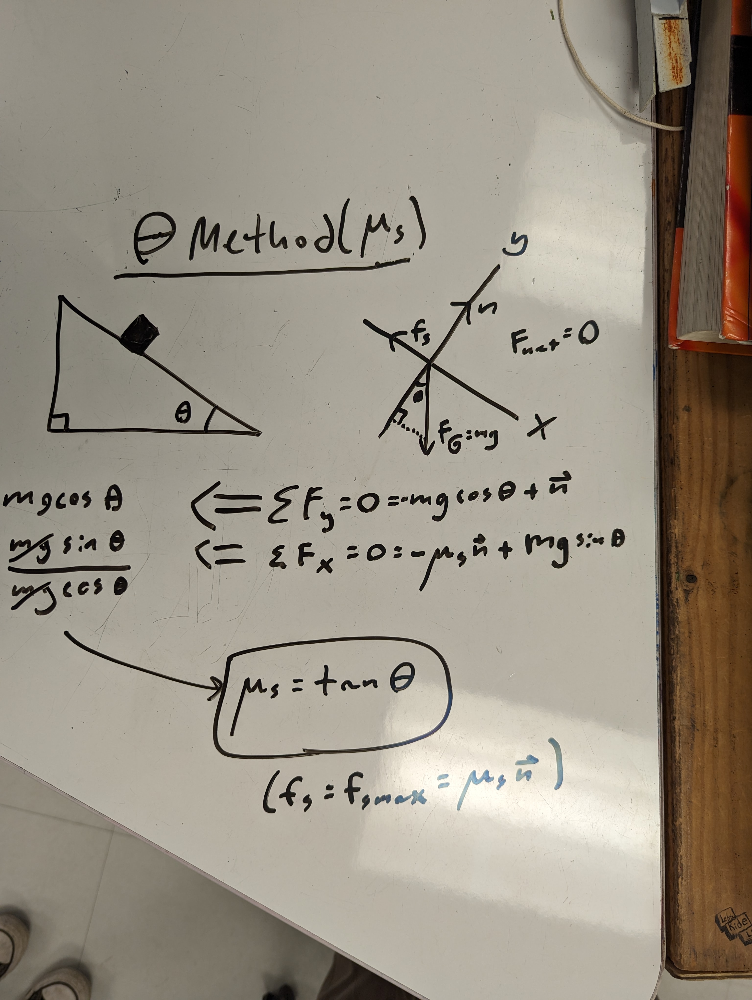

# Introduction

Friction opposes everything we do; however, we couldn’t stand up straight or
even sit down without it. Friction is a parallel force exerted by a surface in
contrast to an applied force. Notably, friction can be divided into two
categories, static and kinetic, depending on the motion of the body it is
applied to. Through this lab we intend to explore the properties of friction and
apply our understanding of mathematics and physics to discover several unknown
values relating to friction through various experiments.

# Frictional Coefficients of a Block

In this experiment, we were tasked with finding the coefficients of static and
kinetic friction between a block and a smooth board. We came up with four
experiments to calculate two values for the static coefficient and two for the
kinetic.

First we calculated the mass of the block by measuring a tension force necessary
to keep the block at rest in the air (meaning only tension and gravity acted on
the block). We obtained a value of 0.561 kg for the mass of the block.

{ height=256px }

## Theta Method ($\mu_s$)

Our first method for measuring the static friction coefficient was to tilt the
board until the block moved and measure the angle right as that happened. We
measured an angle of 14 degrees right before the block moved. So
$\mu_s=\tan(14)=0.429$.

{ height=256px }

## Force Method ($\mu_s$)

Next we tried to find $f_{s,max}$ directly --- solving for $\mu_s$ next --- by
creating an equivalent tension force using a hanging mass (and measuring the
mass). The hanging masses totaled 150 g at the threshold where the block held in
place by static friction would move. So $\mu_s = 0.150\,\text{kg} /
0.561\,\text{kg} = 0.267$.

{ height=256px }

## Theta Method ($\mu_k$)

This experiment was the most complex but still gave us a value for $\mu_k$. We
released the block to slide down the board at a known angle greater than the
threshold found for static friction and measured the time it took to traverse
the entire board, a distance we measured too. When we released the block at an
angle of 26 degrees, it took 1.55 s to transverse the distance of the board,
1.05 m. So $\mu_k = \frac{ (9.8\text{ms}^{-2})\sin(26)
-\frac{2(1.05\,\text{m})}{ (1.55\,\text{s}))^2}}{
(9.8\text{ms}^{-2})\cos(26)} = 0.388$.

The calculations below make one mistake (not dividing all the terms by
$g\cos(\theta)$); the actual equations should be,

$$ \mu_k = \frac{g\sin(\theta)}{g\cos(\theta)} - \frac{a}{g\cos(\theta)} $$

$$ \mu_k = \frac{g\sin(\theta) - \left(\frac{2x}{t^2}\right)}{g\cos(\theta)} $$

{ height=256px }

## Constant Velocity Method ($\mu_k$)

Here a person pulled the block along at a constant velocity using a force gauge
to measure the tension required to cancel out the friction force ($\vec F_{net}
= 0$).

{ height=256px }

We measured a force to pull the block at a constant velocity to be 1.352 N. So
$\mu_k = 1.352\,\text{N} / 5.5 \,\text{N} = 0.246$.

{ height=256px }

## Analysis

The difference between our static measurements is 0.162, and for kinetic
friction the difference is 0.142. Both differences are similar to each other,
meaning something about the nature of the experiments must cause this. This,
along with the fact that both theta methods (where the board was not level) were
higher than their companion experiments, implies that something changes when the
board is level vs. at an angle.

This could be because the string doesn't align with the center of mass of the
object (for the force and constant velocity methods, both of which used the
string where the theta methods didn't). If the string's mount was too high, then
the force pulling on it could create additional force in the y-direction. This
would reduce the normal force and therefore the friction coefficient would be
higher to maintain the same motion. If the opposite is true --- where the string
pulls at the bottom increasing the normal force --- than the friction
coefficient would seemingly be less, which is what the data shows.

This means the theta methods generated more accurate data, and if these
coefficients needed to be measured accurately, the level board methods should be
ignored or redone. Overall, though, the static friction coefficient values are
greater than the kinetic values, which makes sense as when you overcome the
maximum static friction force, the object accelerates immediately since it
becomes reliant on the new kinetic coefficient of friction.

# You'll Find That Book Filed Under Friction

(Note the lack of a smiley face on the book. This is because the book was rubbed
all over the floor.)

{ height=256px }

This experiment's objective was to find the kinetic coefficient of friction
between a textbook and a level board. To find this, a textbook was aligned with
the taping marked on the tile floor (1 m by 1 m). The textbook was shoved, and
its motion was videotaped using an iPad. The motion in the video was then
analyzed using the video physics program, which tracked the textbooks motion and
graphed it accordingly:

{ height=256px }

Using the slope from the linear approximation of the velocity (the rate of
change of velocity, acceleration), we calculated the kinetic coefficient of
friction: $\mu_k = -(-2.97\,\text{ms}^{-2}/9.8\,\text{ms}^{-2}) = 0.30$.

This seems to be a reasonable drag coefficient, given the situation, and our
previous experiments. 0.3 is far from being too slippery or unreasonably rough.
The textbook further confirms a reasonable outcome, with our data most similarly
aligned with the coefficient of rubber on wet concrete (0.25).

# What Goes Up

In this experiment, we were tasked to determine the impact of drag on the
trajectory of a ball thrown into the air. Particularly, the time it would take
for the ball to reach its peak, and the time from there to hit the ground again.
For this, we used the iPad to track the ball’s acceleration, which we could
later use to solve for the drag force. Before the experiment, we theorized that
due to the vectors for drag and gravity aligning, the ball would hit its peak
much earlier; consequently, drag and gravity would partially cancel each other
out, resulting in an overall lower acceleration, and therefore greater time.

{ height=256px }

Our findings aligned with our theory, with the graph curving slightly to show a
reduced acceleration on the descent and a higher deceleration on the ascent.

{ height=256px }

Using the "instantaneous" acceleration at the start and end, we can calculate
the magnitude of the drag forces.

{ height=256px }

Measuring the rate of change of velocity at the start and end of the throw, the
slope from the velocity graph, we get two values.

{ height=256px }

{ height=256px }

Using these and the equations, the magnitude of the drag force at the beginning
of the throw was $| -0.8\,\text{kg}\,(9.8\,\text{ms}^{-2}-
25.311\,\text{ms}^{-2}) | = 28.09\,\text{N}$. And for the end of the throw, the
magnitude of the force of drag is $|0.8\,\text{kg}\,(-1.636\,\text{ms}^{-2} +
9.8\,\text{ms}^{-2})|= 6.53\,\text{N}$.

We know that,

$$ F_D = \frac{1}{2}C\rho A v^2 $$

$$ F_D \propto v^2 $$

We believe that these are reasonable numbers because of this relation. Since
drag is proportional to the square of velocity, the ball would face much higher
drag as it was thrown where its velocity is at its highest. While it was able to
descend quickly, it was unable to reach the original velocity, meaning the drag
force at the end was less than at the beginning, as the drag itself decreased
the momentum.

# Conclusion

During this lab, we applied our skills to reinforce the differences between
kinetic and static friction and the use cases and processes for deriving the
friction coefficients. This allowed us to gain a better understanding of the
properties of friction, the way it behaves and even to predict its behavior
without measurements. Given that friction plays a role in all mechanical
processes, being able to understand and apply the skills learned in this lab
will be a huge help in future problems both in future labs and in everyday
problems. 

