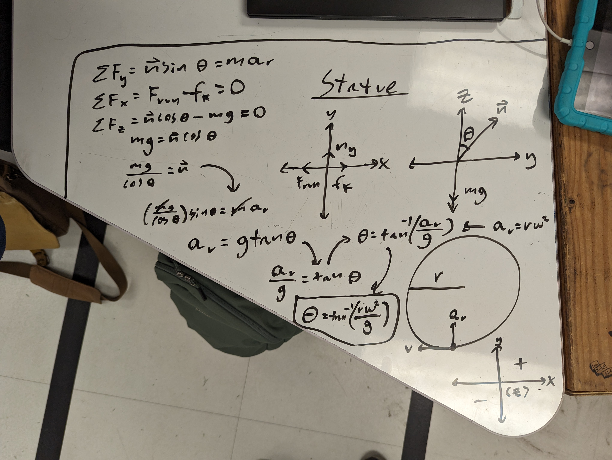
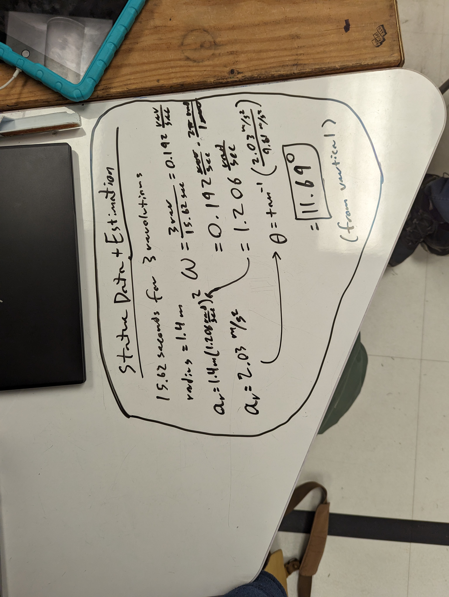
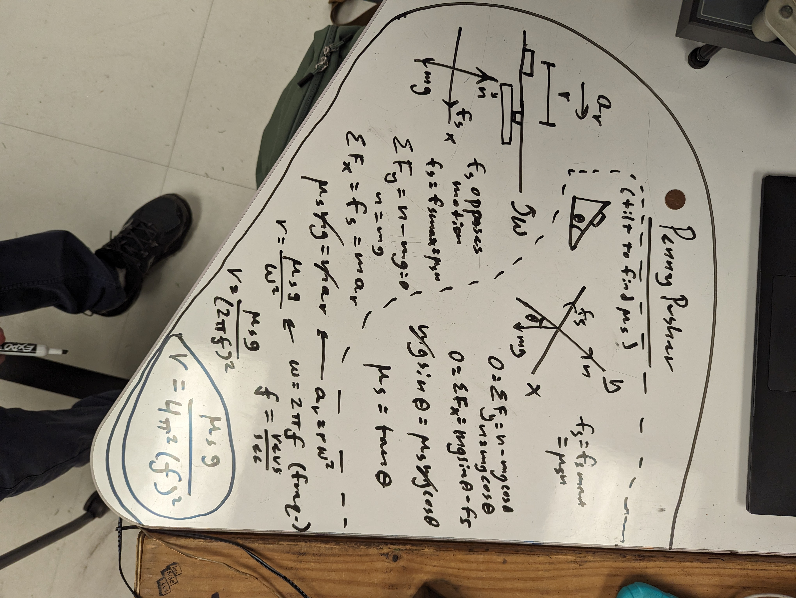
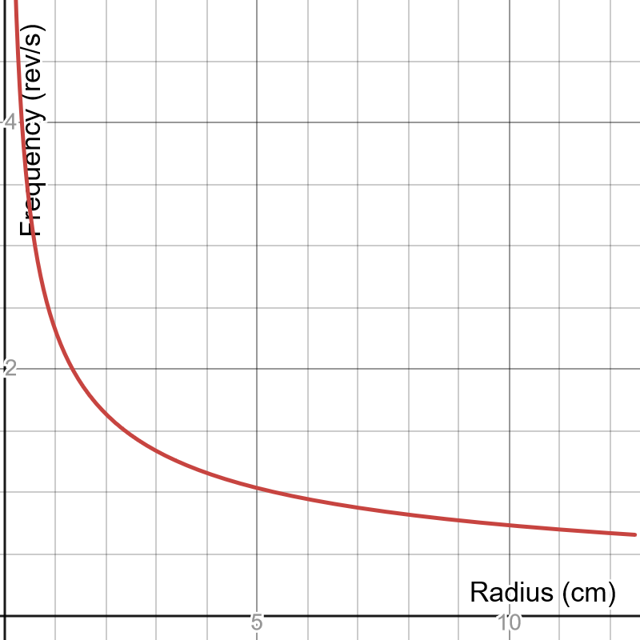
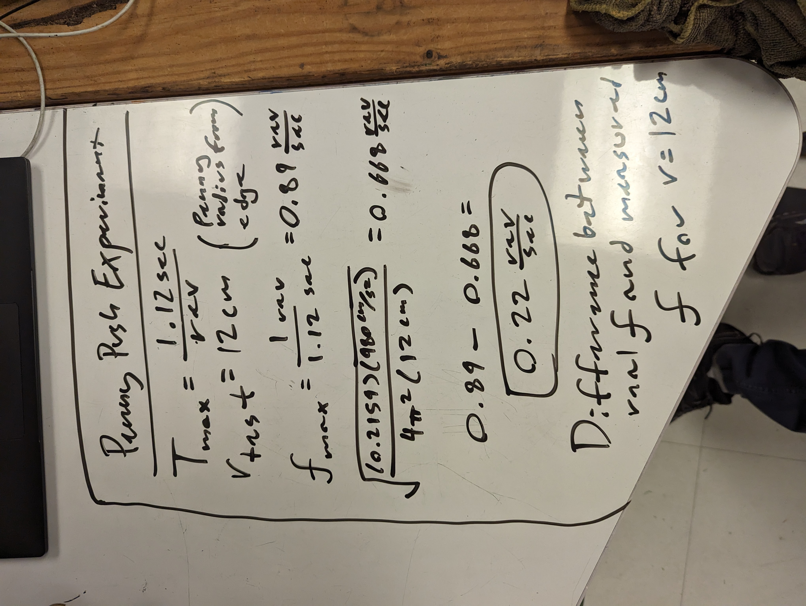

# Introduction

Rotational forces are a concept we are all too familiar with as a side effect of
everyday life, but understanding the intricacies is another matter entirely.
Because forces can only be applied linearly, dealing with circular motion seems
almost impossible at first. However, by realizing that, at any given time, an
object is only ever moving forward, just constantly under some other force, it
becomes a lot more manageable. In this lab, we intend to explore the model of
circular motion and the forces it implies across a handful of various
experiments.

# Running in Circles

Subconsciously, when walking in a circle, humans have learned to lean into the
turn to allow normal forces to help us keep our balance while making tighter
turns, without the need to slow down substantially. More specifically, humans
push against the ground at an angle to cause the ground to push back at an equal
and opposite force, which causes the human to accelerate.

Humans make sure to rotate their pushing force against the ground as they walk
in a circle to always be in line with the radius of the “current” circle they
are moving on. In this experiment, we are tasked with finding the angle someone
leans at during this process. To complete this, we will have to find the
properties of the circle someone walks, alongside estimating the speed at which
they are moving.  

The angle ($\theta$) is the angle we are looking for, since it mirrors the angle
of the force the human exerts on the ground (where they walk at the angle to do
so). It is also important to note that friction and the force walking forward in
the “x” plane will cancel out, as Jonah will be moving at a constant velocity.
Now, we still need to calculate angular velocity ($\omega$) and the radius. 

We estimated that while Jonah walked around the circle at the statue, he would
have been leaning around 11.69 degrees into his turn, this is further backed up
by the photo we took while he was walking around the circle.

This helps us to understand the application of banked surfaces, as the same
principle is applied to them, by leaning into a turn, we add a horizontal
component to our normal force, which we then can use to maintain easier balance
by moving our center of mass in line with the angled normal force to take
tighter turns faster. 

## Penny Pusher

In this experiment, we are tasked to find the frequency at which a penny will
start to fall from a spinning plate. This would require us to find the static
coefficient of friction between the penny and the plate which was accomplished
by finding the angle at which the penny slid off the tilted, stationary plate.
From there, we had everything we needed to make our predictions.

From here ($\mu_s = 0.2597$), we could predict the point where the maximum
static friction will be reached. Given the fact that the radius of the penny's
motion heavily impacts the results, we elected to plot this for every point on
the disc. (Although we only had time to get one data point; if we had more, we
would've tested multiple radii to see if the data would align with the
prediction graph.)

We measured the penny’s distance from the center of the plate to be around 12
cm, which according to our prediction, would start to fall around 0.668 rev/s.
We then ramped up the speed and measured the period of rotation based on a
common marker on the platter, converting to frequency.

Our experimental data showed it slipping around 0.2 rev/sec more than predicted,
but this is within reasonable error! We aren’t entirely sure what caused this,
though it's possible that our measurements for friction coefficient are off,
given that we had to hold the table perfectly still. Or even just that Alec's
reaction time was not fast enough or consistent enough to give us accurate
experimental data.

One of the major concepts this experiment did reinforce, however, is the idea
that the radius of your rotation effects the required static friction force
necessary to maintain equilibrium ($a = \vec 0$). Higher radii result in greater
radial acceleration which must be accounted for by the friction force and vice
versa.

## Conclusion

Throughout this lab, we managed to refine our understanding of circular motion
and demonstrated the ability to predict properties of this motion based on
different conditions. Given that rotation is one of the most essential
mechanical processes, understanding and predicting it is extremely useful in
many STEM fields, especially engineering. From calculating the velocity of a
propeller blade or the behavior of a series of cogwheels, this is a skill that
will be essential to continue refining and understanding long into our careers.

