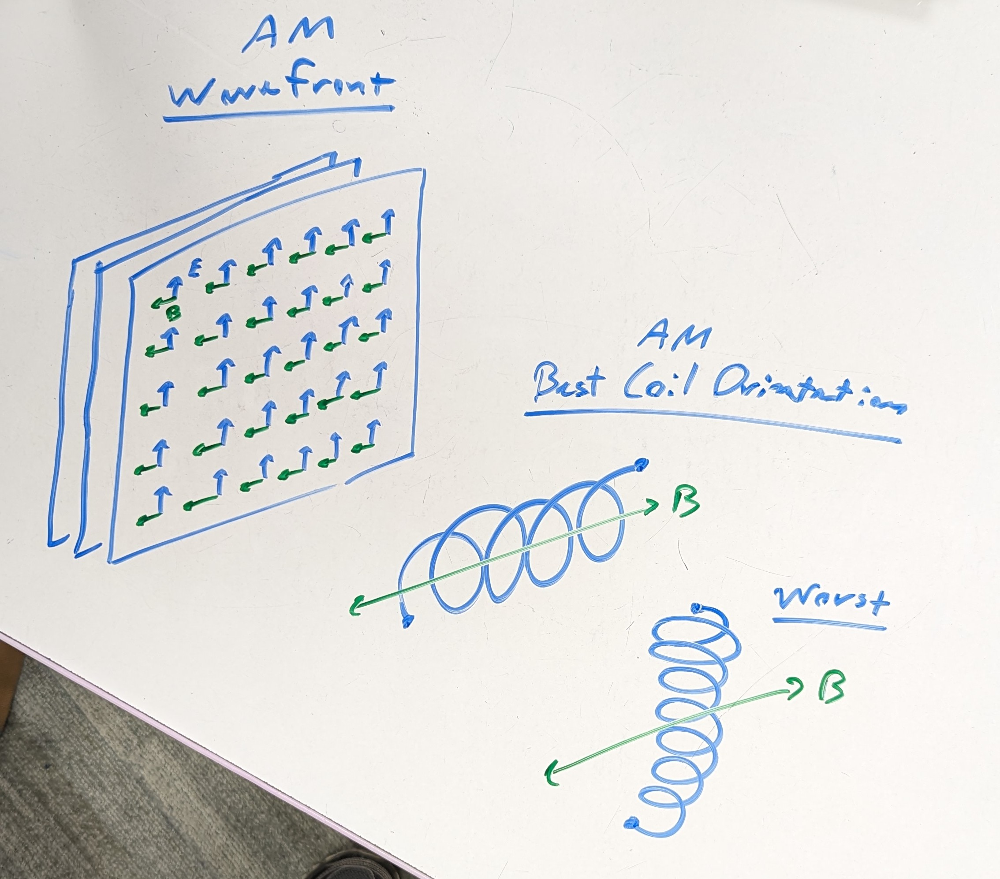
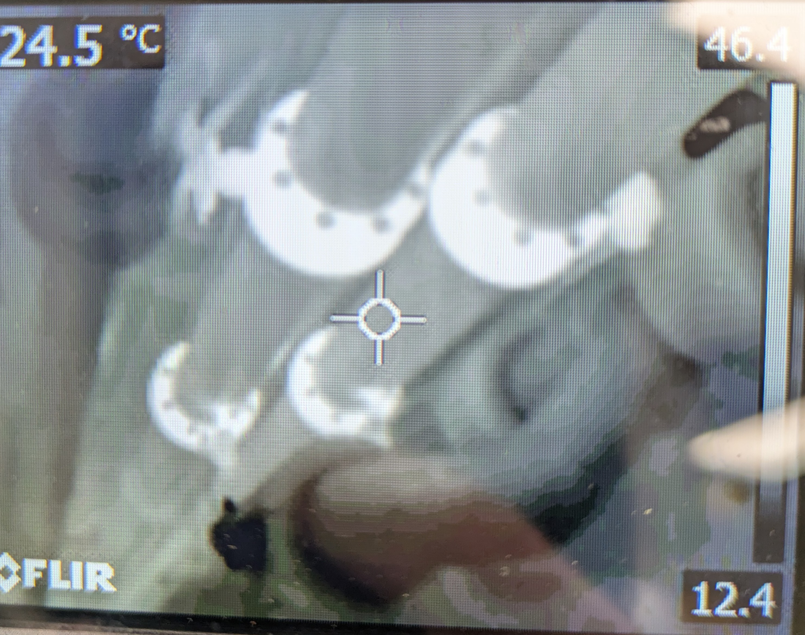
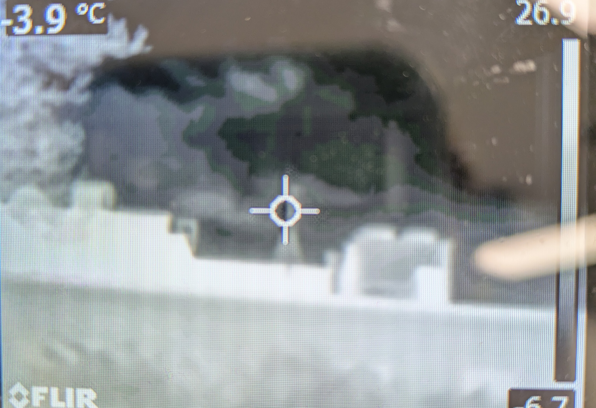
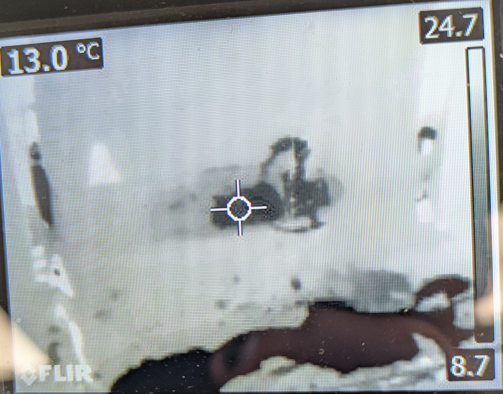
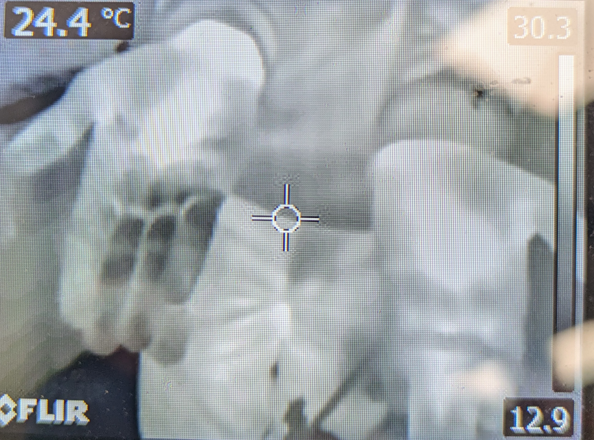
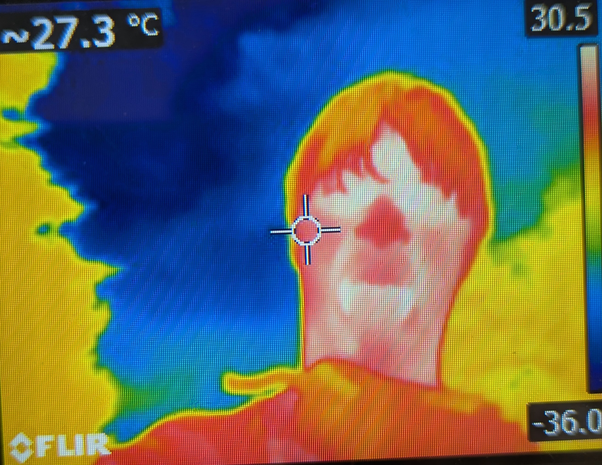

# Introduction

While light is often associated with visibility, only a small portion of the
electromagnetic spectrum is actually visible to the human eye. Despite this,
we’ve managed to reveal the impact this light has on the world around it, and
through that we are able to interact with and understand these invisible
frequencies. In this lab we intend to investigate the ways in which low to
medium frequency radio waves can be interrupted and disturbed by surrounding
objects, alongside investigating how Infrared radiation interacts with different
surfaces, alongside finding objects that only emit in the IR spectrum.

# Defining Terms

An object absorbs light when electromagnetic waves don't reflect off the
surface. This makes them appear darker in whatever frequency is being absorbed,
as the waves that are absorbed aren't reflected back into the observer's
eyes/camera. For example, chlorophyll pigment in plants reflects green visual
light, which is why plants are green.

Physically, this is caused by the chemical properties of the matter oscillating
differently with incoming plane waves. The electromagnetic waves interact with
the charged, low-mass electrons causing them to oscillate. If the oscillation
interferes with the plane wave, light is reflected (e.g. wood, to some degree);
and, if the oscillation is in line with the plane wave, the light is transmitted
(e.g. water, to some degree). All types of oscillation exist in between and give
rise to many optical properties of matter.

Objects can also emit light from non-induced oscillations. For example, an
alternating current can cause electrons to oscillate and produce electromagnetic
waves. Heat, which is the general random movement or vibration of atoms, can
also cause electrons to oscillate and produce electromagnetic waves (e.g. IR
radiation produced by humans). If there is no outside light to be reflected by
an object, and it still seems to reflect light, it could be *emitting* the light
itself.

## Derivation of Electromagnetic Waves

For fun, and to have a bit of math in this lab, here is a derivation of the wave
equation for light from Maxwell's equations. The three equations needed are:

$$ \vec \nabla \times \vec E = -\frac{\partial \vec B}{\partial t} \qquad \vec
\nabla \cdot \vec E = \frac{\rho}{\epsilon_0} \qquad \vec \nabla \times \vec B =
\mu_0\left(\vec J + \epsilon_0 \frac{\partial \vec E}{\partial t}\right) $$ 

Next, take the curl of Faraday's Law and apply identities:

$$ \vec \nabla \times \left(\vec \nabla \times \vec E\right) = \vec \nabla
\times \left(-\frac{\partial \vec B}{\partial t}\right) $$

$$ \vec \nabla \left(\vec \nabla \cdot \vec E\right) - \vec \nabla^2 \vec E= -
\frac{\partial}{\partial t}\left(\vec \nabla \times \vec B \right) $$

Assuming there are no charges or currents ($\rho=0$, $\vec J = 0$) and plugging
in the previous equations:

$$ \vec \nabla^2 \vec E = \frac{\partial}{\partial t}\left(\mu_0\epsilon_0
\frac{\partial \vec E}{\partial t}\right) $$

$$ \boxed{\vec\nabla^2\vec E=\mu_0\epsilon_0\frac{\partial^2 \vec E}{\partial
t^2}} $$

The wave equation is defined as:

$$ \vec\nabla^2\vec U c^2 = \frac{\partial^2 \vec U}{\partial t^2} $$

The propagation speed of the wave is $c^2$, therefore the speed of
electromagnetic waves (light) is:

$$ \vec\nabla^2\vec E=\mu_0\epsilon_0\frac{\partial^2 \vec E}{\partial t^2} $$

$$ \vec\nabla^2\vec E \frac{1}{\mu_0\epsilon_0}=\frac{\partial^2 \vec
E}{\partial t^2} $$

$$ c^2 = \frac{1}{\mu_0\epsilon_0} $$

$$ \boxed{c = \frac{1}{\sqrt{\mu_0\epsilon_0}}} $$

# Radio Locations

Materials: Radio (Listening on AM Frequency)

Methods: Tune the radio, once a signal is acquired, hold the radio close to your
body. Rotate around, take note of how much of an impact the static has on the
overall audio output of the radio.

Results: While rotating around, we’d notice that the signal was the strongest
while facing South, and weakest while facing to the North West.

Analysis: AM radio works by detecting the oscillating magnetic field of radio
waves. The solenoid coils are best aligned as seen in the image to maximize the
current based on the specific magnetic flux through the enclosed area.

# Near Infrared Goggles

Materials: Near IR Filter Goggles

Methods: Put the goggles on and wander around campus. Take notes of objects
demonstrating behavior of note.

Results: We noticed that trees and other plants reflect near IR light, windows
and the air itself all transmit light, almost any dark colored object, such as
the keys on my keyboard absorb IR light. Anything that emits heat should also
come with infrared radiation, such as a computer running hot, or even people.

Analysis: We noticed that darker color objects tend to absorb IR light, with
lighter colors reflecting it. It should be worth noting that near IR light, when
viewed by the human eye, appears red due to the fact that it exists on a
frequency extremely close to red, where small deviations could likely cause the
normally invisible light to appear as red.

# Measuring Temperature with Thermal Radiation

Materials: Infrared camera.

Methods: Use the infrared camera to image a variety of objects and determine how
they interact with IR light by how they appear on camera.

Results: The pipes were ambient temperature while the pipe connections were very
warm, visible in figure 2. The chimneys on top of the building were very cold
while the metal around it seemed to reflect heat, seen in figure 3. The water
from the water fountain was very cold. A thermal reflection could be seen in the
metal of the water fountain as seen in figure 4. Jonah’s hand that got wet was
colder than the hand that was not wet as seen in figure 5.

Analysis: The pipes are room temperature because they insulate the exterior from
whatever is on the interior. The connectors are very hot because the insulation
of the pipe is not as good there so the heat in the pipe is being emitted. The
chimneys from Glover seem to be absorbing heat because they are cold. The metal
is reflecting heat, this is why it is hot but not emitting. The water absorbed
heat very well which is why it appears so dark, since IR is light, it was
reflected by the metal on the fountain which is why a reflection appears. The
water also soaked the heat from Jonah’s hand which is why one hand was darker
than the other.

# Conclusion

Electromagnetic waves, which act as photons, are the fundamental force-carrier
of the electromagnetism. Most chemical reactions, optics, and physical
interactions with the universe would not be possible without them. For example,
as we saw in this lab, electromagnetic radiation is a powerful carrier of heat
energy. The temperature of objects we saw around campus was very closely related
to their exposure to the sun's radiation. It was also clearly a measure of the
temperature of objects, as best demonstrated by the water fountain. Overall, the
applications of electromagnetic waves to science and engineering are priceless,
and understanding the underlying principles is likewise very important.

